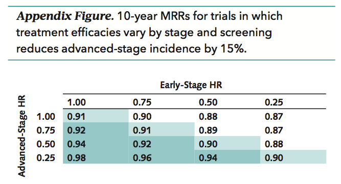

```{r setup, include=FALSE}
knitr::opts_chunk$set(echo = TRUE)
```

# MRR due to screening stage-shift only, no treatment

## Population
Consider a population of 100,000 women aged 50 for whom we will assess the impact of screening at the 10-year follow-up, when they are aged 60. Given the short time span, we will assume a single incidence rate and  negligible other-cause mortality among incident cases. 

## Breast cancer mortality for advanced versus early-stage cases

```{r}
cum.mort <- function(rate, year=10, haz=1) {1-exp(-year*rate*haz)}
# USA, advanced-stage: proportion of cases dying by 10 years post-incidence
# From Annals paper
(m.a_usa <- cum.mort(.10693))
# USA, early-stage: proportion of cases dying by 10 years post-incidence
# From Annals paper
(m.e_usa <- cum.mort(.01992))
# Uganda, advanced-stage: proportion of cases dying by 10 years post-incidence
# From Galukande reference
(m.a_uganda <- cum.mort(.21))
```

## Model parameters
The following parameters thus approximate our US example: 

Description | Notation | US approximate values
----------- | -------- | ---------------------
Population size | N | 100,000
Proportion clinically incident between ages 50-59 | p~i~ | 0.0021
Proportion of incident cases that are advanced | p~a~ | 0.50
Proportion of advanced cases who die within 10 years | m~a~ | 0.657
Proportion of incident cases that are early | 1-p~a~ | 0.50
Proportion of early cases who die within 10 years | m~e~ | 0.181
Proportion of incident cases shifted by screening | p~s~ | 0.15

## MRR in terms of these parameters

The number of BC deaths in the **absence** of screening is mortality among incident advanced-stage cases plus mortality among incident early-stage cases: 

$Np_{i}[p_{a}m_{a} + (1-p_{a})m_{e}]$

In the **presence** of screening, advanced-stage mortality is decreased by the stage shift and early-stage mortality is increased by that same number of cases:

$Np_{i}[(1-p_{s})p_{a}m_{a} + (1-p_{a} + p_{s}p_{a})m_{e}]$ 

The MRR is the ratio, so thee $Np_{i}$ cancel out:

$$\frac{(1-p_{s})p_{a}m_{a} + (1-p_{a} + p_{s}p_{a})m_{e}}{p_{a}m_{a} + (1-p_{a})m_{e}}$$

The MRR is thus controlled by p~s~, p~a~, m~a~, m~e~. 

Note that the MRR only counts lives saved. The extension of life that still results in mortality before the follow-up period is not valued at all. 

```{r}

# Back-of-the-envelope MRRs
mrr = function(p.a, p.s, m.a, m.e) {
  # Number dying in the absence of screening: 
  # advanced mortality + early mortality
  denominator = p.a*m.a + (1-p.a)*m.e
  # Number dying in the presence of screening:
  # advanced mortality (reduced by stage-shifters) + 
  #   early mortality (increased by stage-shifters)
  numerator = p.a*(1-p.s)*m.a + (1-p.a+p.a*p.s)*m.e
  return(round(numerator/denominator,3))
}

# MRR due to stage shift alone, no treatment
mrr(p.a=0.50, p.s=0.15, m.a_usa, m.e_usa)
# Greater stage-shift
mrr(p.a=0.50, p.s=0.25, m.a_usa, m.e_usa)
# Uganda with 15% stage shift
mrr(p.a=0.89, p.s=0.15, m.a_uganda, m.e_usa)
```

These results confirm the scale of our simulation model MRRs. 

## Recreate the Annals figure
We can use this model to recreate the Annals figure, since all the MRRs are from hypothetical trials in which there is only one treatment administered to all. We just need to alter it to accept hazard ratios:

```{r}

# Now allow for hazard ratios
exp.rate = function(cum.mort, year=10, haz=1) {log(1-cum.mort)/(-year*haz)}
mrr.h = function(p.a, p.s, m.a, m.e, h.a=1, h.e=1) {
  # Get the exponential rates
  rate.a = exp.rate(m.a)
  rate.e = exp.rate(m.e)
  # Get the new 10-year cumulative mortality using the rate and hazard
  new.m.a = cum.mort(rate.a, haz=h.a)
  new.m.e = cum.mort(rate.e, haz=h.e)
  # Denominator and numerator of MRR using new mortalities
  denominator = p.a*new.m.a + (1-p.a)*new.m.e
  numerator = p.a*(1-p.s)*new.m.a + (1-p.a+p.a*p.s)*new.m.e
  return(round(numerator/denominator,3))
}
```



```{r echo = FALSE}
selectInput("hr_early", label = "Early-stage HR",
              choices = c(1, 0.75, 0.50, 0.25), selected = 1)
  
selectInput("hr_advanced", label = "Advanced-stage HR",
              choices = c(1, 0.75, 0.50, 0.25), selected = 1)
```

```{r echo = FALSE}
renderPrint({
  mrr.h(p.a=0.50, p.s=0.15, m.a_usa, m.e_usa, 
        h.a=as.numeric(input$hr_advanced),
        h.e=as.numeric(input$hr_early))
})
```

The results are almost exactly the same. This simple model predicts slightly higher MRRs (smaller screening effect) than the simulation model. 

## Alternative parameterization
An alternative parameterization is not by absolute 10-year cumulative mortality among advanced/early, but as a ratio. 

```{r}
# Current ratio
m.e_usa/m.a_usa

mrr.r = function(p.a, p.s, r) {
  # Same as before but dividing out m.a, such that m.e/m.a = r
  denominator = p.a + (1-p.a)*r
  numerator = p.a*(1-p.s) + (1-p.a+p.a*p.s)*r
  return(round(numerator/denominator,3))
}

# Base MRR - stage shift but no treatment
mrr.r(p.a=0.50, p.s=0.15, m.e_usa/m.a_usa)
```

This parameterization is useful because it allows us to predict scale of the MRR for any setting. Regardless of the absolute mortality rates in each stage group, the ratio of m.e/m.a must logically be between 0 and 1. 

### Choose parameters and see the result
```{r echo = FALSE}

sliderInput("prop_a", label = "Proportion advanced",
              min=0, max=1, step=0.01, value=0.5)
sliderInput("prop_s", label = "Proportion stage-shifted",
              min=0, max=1, step=0.05, value=0.15)
sliderInput("hr_ratio", label = "Ratio of m.e/m.a",
              min=0, max=1, step=0.01, value=0.28)
```

```{r echo = FALSE}
renderPrint({
  mrr.r(p.a=input$prop_a, p.s=input$prop_s, r=input$hr_ratio)
})
```

Note that when the ratio is 0, the MRR is 1 minus the proportion stage-shifted. This is easily proved in the next section on limits. 

## MRR limits

**When m~e~ approaches zero, i.e. early-stage survival is very high**

$$\frac{(1-p_{s})p_{a}m_{a} + (1-p_{a} + p_{s}p_{a})*0}{p_{a}m_{a} + (1-p_{a})*0} = 1-p_{s}$$

The MRR is determined by $p_{s}$, because the second terms in the numerator and denominator approach 0 and the MRR reduces to $1-p_{s}$. This is true regardless of the value of m~a~. We will thus see similar MRRs across populations with varying advanced-stage survival if early-stage survival is high and we assume the same stage shift.  

**When p~s~ approaches 1, i.e. a large stage-shift**
$$\frac{0*p_{a}m_{a} + (1-p_{a} + 1*p_{a})m_{e}}{p_{a}m_{a} + (1-p_{a})m_{e}} = \frac{m_{e}}{p_{a}m_{a} + (1-p_{a})m_{e}}$$

Now the MRR is entirely driven by the original proportion of advanced cases (p~a~) and the mortality rates. I don't know that this is very helpful.

**When p~a~ $\approx$ (1-p~a~), i.e. the population is about 50% advanced, 50% early stage**

The p~a~ and (1-p~a~) terms cancel out, leaving

$$\frac{(1-p_{s})m_{a} + (0.5 + p_{s})m_{e}}{m_{a} + m_{e}}$$

So the MRR is driven by how much p~s~ re-weights screened mortality towards m~e~. Again, I don't know that this is very helpful.

# Conclusion - Jeanette, July 26
This exercise highlights the following considerations:

**MRR is a very blunt measurement tool for a stage-shift process** 

It does not value the degree to which life may be extended by an intervention. It is driven by the stage-shift when early-stage survival is high. It is never a function of incidence levels.

_Should we add life-years saved as an output, and focus on ARRs instead of MRRs?_

**The stage shift defines the lower bound for the MRR in a stage-shift model**

Mathematically, we see that the MRR will definitely approach the stage shift limit as early-stage BC mortality goes to 0. Conceptually, only the shifted cases may potentially be saved, so it seems logical that the MRR does not exceed the stage shift. This is confirmed theoretically with little more math:

Let's divide the MRR equation by $1-p_{s}$. Then, for the ratio $\frac{MRR}{1-p_{s}}$ we get:

$$\frac{(1-p_{s})p_{a}m_{a} + (1-p_{a} + p_{s}p_{a})m_{e}}{(1-p_{s})p_{a}m_{a} + (1-p_{s})(1-p_{a})m_{e}}$$

The numerator and denominator are identical except for one extra term $p_{s}m_{e}$ on the bottom. In other words, the ratio $\frac{MRR}{1-p_{s}}$ is of the form:

$$\frac{MRR.numerator}{MRR.numerator-p_{s}m_{e}}$$

If $m_{e} = 0$, then the ratio $\frac{MRR}{1-p_{s}} = 1$, i.e. MRR = $1-p_{s}$. If $m_{e}>0$, then the the ratio $\frac{MRR}{1-p_{s}} > 1$ and the MRR must be greater than $1-p_{s}$.  

_In the global setting, one way to get greater "bang for buck" in terms of the MRR is to have an intervention that shifts a lot of advanced cases, even if the shifted cases don't have THAT much better mortality. The [alternative parameterization model in section 1.6.1](#choose-parameters-and-see-the-result) shows that if you have 70% advanced cases without screening and you shift 50%, the MRR at 10 years will be 0.80 if the ratio of 10-year survival in early versus advanced cases is 0.5._

_And/or: if it seems unreasonable to have the stage shift limit the MRR lower bound, then we need to make the within-stage shift a standard feature of the model and perhaps calibrate the model (to what? 15% mortality reduction for 15% stage shift?) to get reasonable within-stage shift parameters_

**Treatment distributions don't matter a whole lot**

This little model of only the stage-shift effect of screening gives similar results to the complex model that allows for treatment distributions. This makes sense, since treatment distributions are just weights that define how much the treatment HRs impact m.e and m.a. 

_We can use the simplfied model to explore different stage-shifts and m.e/m.a ratios to show maximum MRRs_

**Perhaps the other-cause survival benefit of screening is important to consider**

Is it possible that the screening effect on all-cause survival would be more important to consider in developing countries where opportunistic care is more rare among unscreened populations? That is something that would impact the MRR. (Comparable other-cause mortality in both screened and unscreened groups does not impact the MRR, right?)

_Could incorporate some hypothetical HRs for OC-survival in the screened arm. Is there any data on this in the global setting?_


